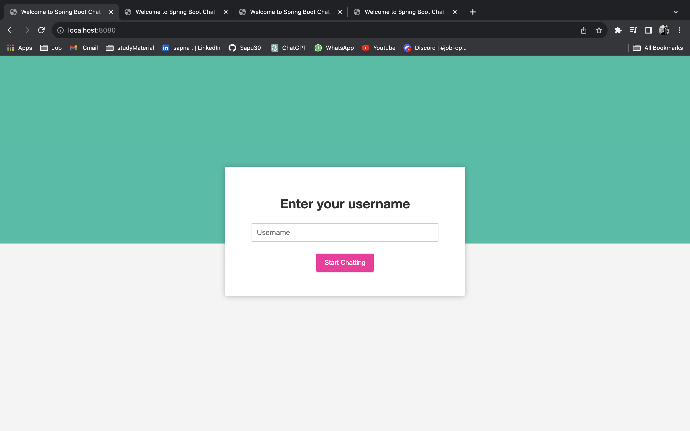
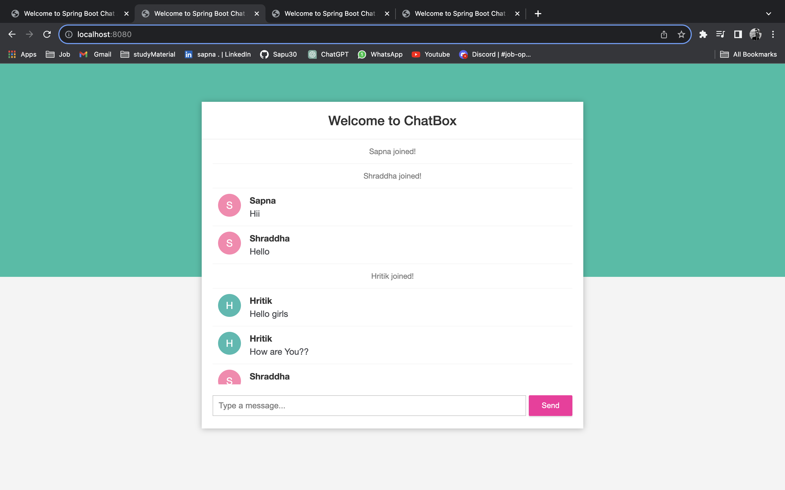
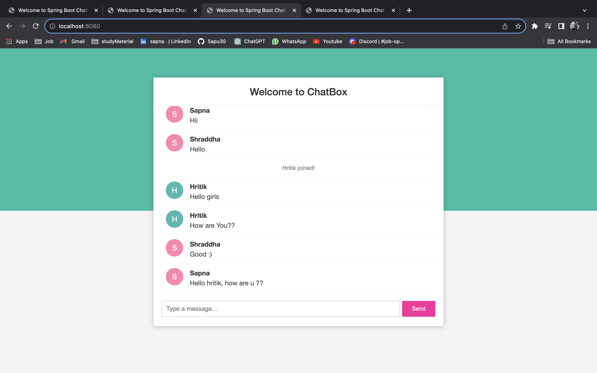
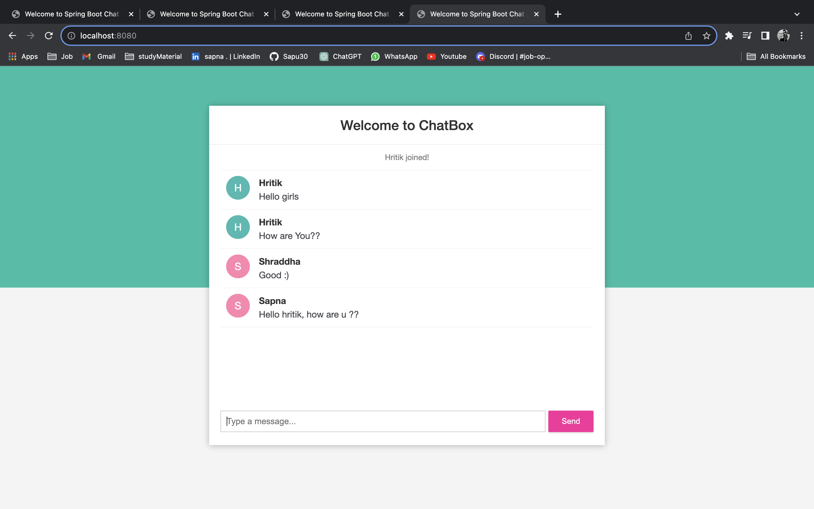

# Chat Application with Spring Boot and WebSocket

A real-time chat application built with Spring Boot and WebSocket, allowing users to communicate by typing their name to log in.

## Overview

Traditional web applications operate on a request-response model, where the server responds to client requests. However, this chat application leverages the WebSocket Protocol to establish two-way communication, enabling real-time interaction without waiting for client requests.

## Features

- Simple login: Users enter their names to start chatting.
- Real-time communication: WebSocket facilitates instant communication between clients.

## Technology Stack

- Spring Boot
- WebSocket Protocol
- java
- maven
- html/css
- javascript

## Images

